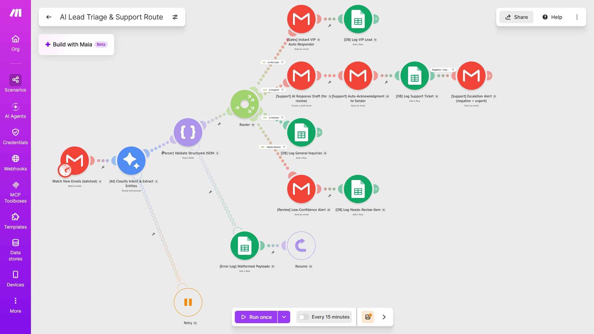

# AI Executive Assistant: Automated Inbox Triage & CRM Routing

An enterprise-grade Make.com automation that uses Gemini 2.5 Flash to intelligently triage inbound emails, extract lead data, handle support escalations, and draft contextual replies.

## 📌 Business Value
This system replaces manual inbox zero routines with an autonomous triage agent:
- **Zero Missed Revenue:** "Hot leads" (sales/quotes) are instantly escalated to the team via email alerts, complete with parsed contact data and an AI-drafted reply.
- **Support Triage:** Customer issues are automatically appended to the correct email thread with an AI-generated draft response waiting for human approval.
- **SLA Protection:** Negative sentiment tickets with high urgency trigger immediate escalation alerts.
- **Noise Reduction:** General inquiries and spam are silently logged to a database, bypassing the inbox entirely.

## ⚙️ Technical Architecture & Features
This is not a simple linear router; it is built for production resilience:

1. **Named Entity Recognition (NER):** Beyond basic classification, the AI extracts `company_name`, `contact_phone`, `urgency_score` (1-10), and `sentiment` to structure raw email text into actionable CRM data.
2. **Native Thread Handling:** Utilizes Gmail `threadId` mapping to ensure AI-drafted replies and automated acknowledgments attach cleanly to the customer's original email conversation.
3. **Advanced Error Handling:** 
   - **API Resiliency:** Implements `Break` directives with automatic retry intervals to handle LLM API timeouts or rate limits.
   - **Fallback Routing:** Uses `Resume` directives on the JSON parser. If the LLM hallucinates malformed output, the system safely falls back to a `NEEDS_REVIEW` state rather than crashing the execution.
4. **Mid-Branch Execution Logic:** Strategically orders database logging before inline escalation filters to ensure 100% data capture regardless of conditional branch drops.

## 🚀 How to Install & Use
1. Download the `AI Lead Triage & Support Route.blueprint.json` file from this repository.
2. Create a new scenario in Make.com.
3. Click the `...` (More) menu at the bottom and select **Import Blueprint**.
4. Map your Google (Gmail & Sheets) connections to the respective modules.
5. Create a Google Sheet with columns matching the extraction schema (Timestamp, Sender, Subject, Category, Urgency, Sentiment, Action, Draft, Company, Confidence, Action, Phone).

### 💡 Upgrades & Scalability
* **CRM Integration:** This blueprint uses Google Sheets as a universally accessible database for demonstration. In a production environment, the Sheets modules can easily be swapped out for native CRM routing (HubSpot, GoHighLevel, Airtable, Pipedrive) to drop leads directly into your sales pipeline.
* **Model Selection:** The scenario is currently configured with the free **Gemini 2.5 Flash** model for fast, cost-effective triage. For highly complex or multilingual inboxes, swapping this for a premium reasoning model (like Gemini 1.5 Pro or OpenAI GPT-4o) is recommended for maximum extraction accuracy.
